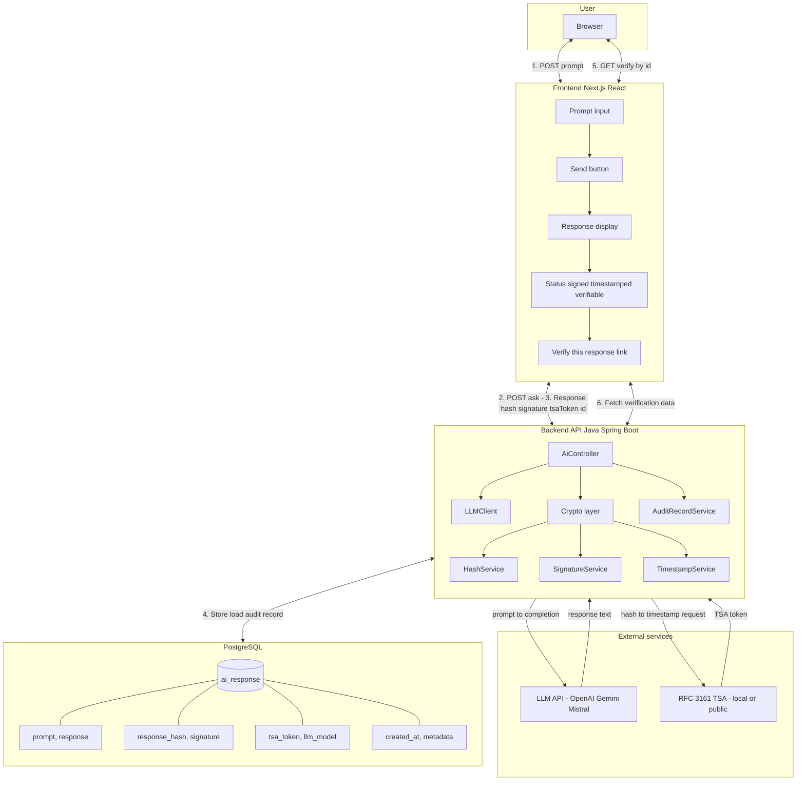
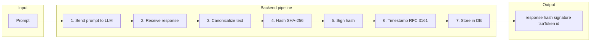
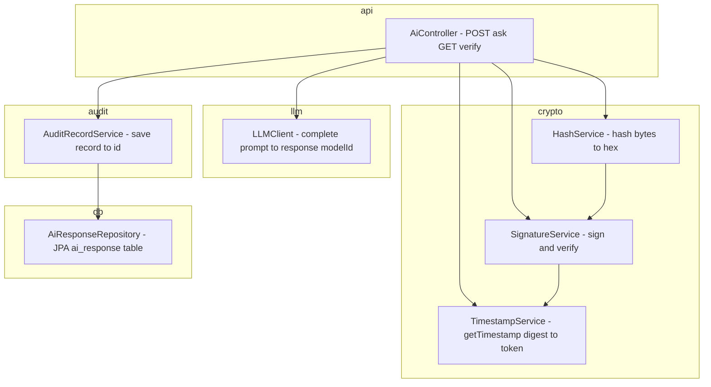
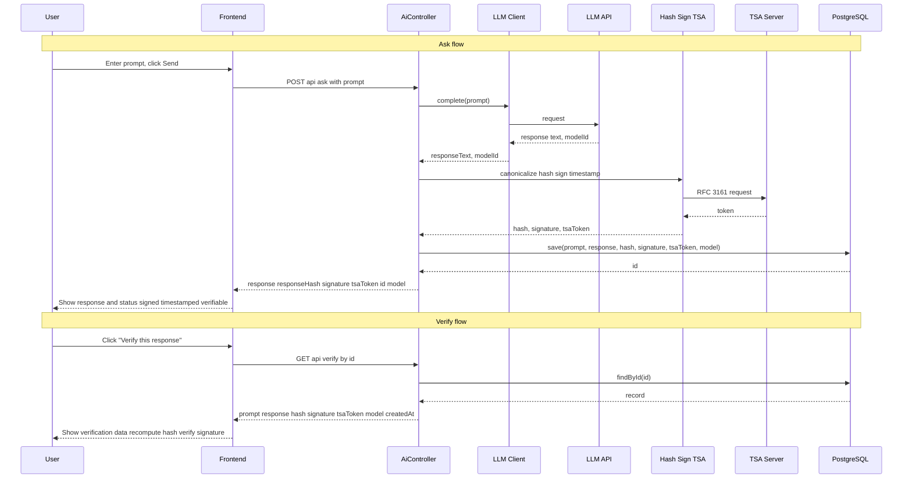
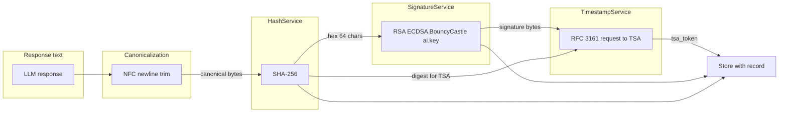
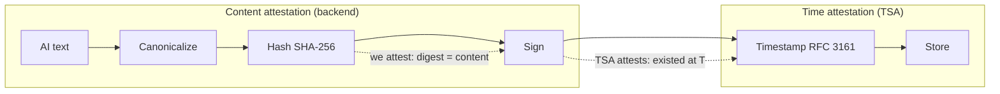
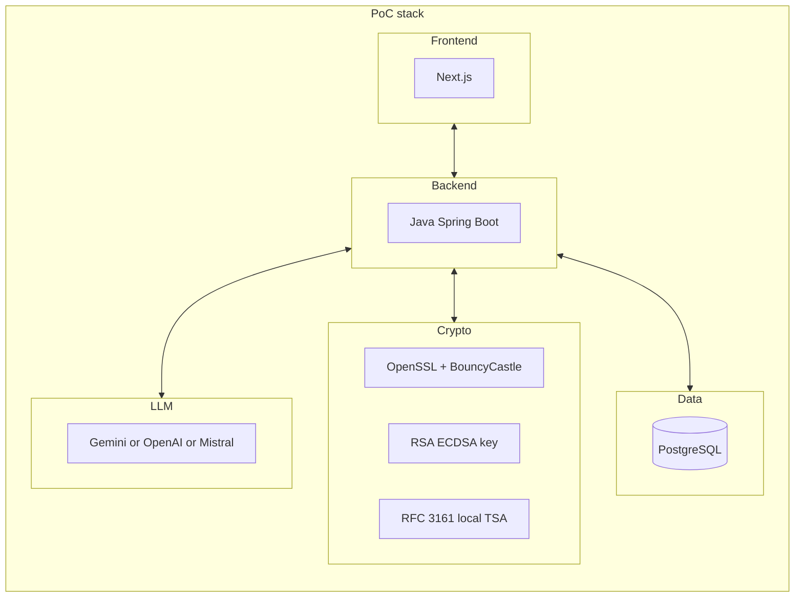

# Aletheia AI — Architecture Diagrams

Detailed Mermaid diagrams for the PoC: verifiable AI responses with signing and RFC 3161 timestamps.

---

## 1. High-level system architecture



---

## 2. Backend request pipeline (7 steps)



---

## 3. Backend module structure



---

## 4. Data flow: Ask & Verify



---

## 5. Crypto layer detail



---

## 6. Trust chain

Who attests what: we attest *content* (signature over hash); TSA attests *time* (timestamp over signature bytes). See [Trust model (EN)](../docs/en/TRUST_MODEL.md).



---

## 7. Stack overview



---

## 8. RSA PKCS#1 v1.5 signature padding (why tokens differ)

RSA signatures use random padding. Same hash + same key → different padding → different bytes. See [CRYPTO_REFERENCE — RSA signature randomness](../docs/en/CRYPTO_REFERENCE.md#rsa-signature-randomness-and-semantic-determinism-learners).

```
┌─────────────────────────────────────────────────────────────────────────────────────┐
│  PKCS#1 v1.5 Signature Block (256 bytes for 2048-bit key)                            │
├──────┬──────┬─────────────────────────────┬──────┬───────────────────┬───────────────┤
│ [00] │ [01] │  [FF FF FF ... FF]          │ [00] │ [hash_algorithm]  │ [hash_value]  │
│      │      │  ← RANDOM (SecureRandom)    │      │ (OID)             │ (32 bytes)    │
└──────┴──────┴─────────────────────────────┴──────┴───────────────────┴───────────────┘
  block  sig     padding varies each call       sep    fixed              fixed
  start  type
```

**Flow:** `sign(hash)` → SecureRandom fills padding → RSA applied → different bytes every time.

---

## Related documentation

- **PoC:** [EN](../docs/en/PoC.md) · [RU](../docs/ru/PoC.md) · [ET](../docs/et/PoC.md)
- **Plan:** [EN](../docs/en/plan.md) · [RU](../docs/ru/plan.md) · [ET](../docs/et/plan.md)
- **Signing:** [EN](../docs/en/SIGNING.md) · [RU](../docs/ru/SIGNING.md) · [ET](../docs/et/SIGNING.md)
- **Timestamping:** [EN](../docs/en/TIMESTAMPING.md) · [RU](../docs/ru/TIMESTAMPING.md) · [ET](../docs/et/TIMESTAMPING.md)
- **Trust model & eIDAS:** [EN](../docs/en/TRUST_MODEL.md) · [RU](../docs/ru/TRUST_MODEL.md) · [ET](../docs/et/TRUST_MODEL.md)
- **MOCK_TSA:** [EN](../docs/en/MOCK_TSA.md) · [RU](../docs/ru/MOCK_TSA.md)
- **Crypto reference** (algorithms, padding, digest, serial): [EN](../docs/en/CRYPTO_REFERENCE.md)
- **Cryptographic Oracle:** [EN](../docs/en/CRYPTO_ORACLE.md) · [RU](../docs/ru/CRYPTO_ORACLE.md) · [ET](../docs/et/CRYPTO_ORACLE.md)
- **Agent Audit Model:** [EN](../docs/en/AGENT_AUDIT_MODEL.md) · [RU](../docs/ru/AGENT_AUDIT_MODEL.md) · [ET](../docs/et/AGENT_AUDIT_MODEL.md)
- **Testing Strategy:** [EN](../docs/en/TESTING_STRATEGY.md) · [RU](../docs/ru/TESTING_STRATEGY.md) · [ET](../docs/et/TESTING_STRATEGY.md)
- **README:** [../README.md](../README.md)
