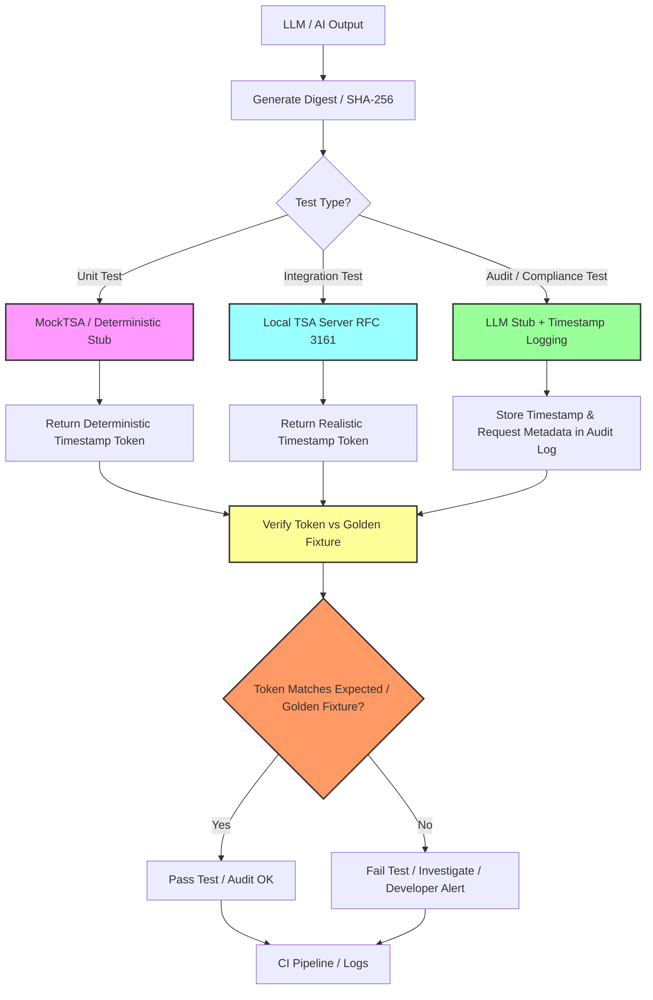

# Testing Strategy

**Comprehensive testing approach for Aletheia AI: unit, integration, mock-based, and end-to-end testing for cryptographic correctness, reproducibility, and auditability.**

---

## Table of Contents

- [Purpose](#purpose)
- [Testing Principles](#testing-principles)
- [1. Unit Testing](#1-unit-testing)
- [2. Integration Testing](#2-integration-testing)
- [3. Mocking / Deterministic Stubs](#3-mocking--deterministic-stubs)
- [4. Regression Testing](#4-regression-testing)
- [5. End-to-End / Smoke Testing](#5-end-to-end--smoke-testing)
- [6. LLM / AI Output Testing](#6-llm--ai-output-testing)
- [7. Automation & CI](#7-automation--ci)
- [8. Test Fixtures Organization](#8-test-fixtures-organization)
- [9. Notes and Best Practices](#9-notes-and-best-practices)
- [Related Documents](#related-documents)

---

## Purpose

This document outlines the **testing strategy for Aletheia AI** and related backend services, focusing on:

- **Timestamping** (RFC 3161)
- **Signing** (RSA PKCS#1 v1.5)
- **LLM-driven features** (agent outputs, audit trails)

The strategy combines **unit, integration, and mock-based testing** to ensure:

- **Correctness** — cryptographic operations produce valid outputs
- **Reproducibility** — same input always produces same output (determinism)
- **Auditability** — all outputs are verifiable against golden fixtures

### Testing Workflow Overview



**Key flows:**
- **Unit tests** → MockTSA (deterministic tokens) → golden fixtures
- **Integration tests** → Local TSA Server (realistic RFC 3161 tokens)
- **Audit/Compliance tests** → LLM Stub + Audit logging → traceable evidence

---

## Testing Principles

| Principle | Description |
|-----------|-------------|
| **Determinism** | Tests must be reproducible: same input → same output |
| **Isolation** | Unit tests run without external dependencies (network, TSA, LLM) |
| **Offline-first** | Use mocks and stubs for external services |
| **Golden fixtures** | Store reference outputs for regression testing |
| **Fast feedback** | Tests run quickly in CI/CD pipeline |
| **Comprehensive coverage** | Unit → Integration → E2E |

---

## 1. Unit Testing

**Purpose:** Verify the smallest components in isolation.

### Core Targets

| Component | Test Focus |
|-----------|------------|
| **Canonicalization** | Text normalization (whitespace, Unicode, etc.) |
| **Hashing** | SHA-256, SHA-512 output correctness |
| **Signature generation** | RSA PKCS#1 v1.5 deterministic signing |
| **Signature verification** | Valid/invalid signature detection |
| **Timestamp request formatting** | RFC 3161 TSQ creation |
| **Mock TSA responses** | Parsing and validation of TSR |

### Guidelines

- **Framework:** JUnit 5 (Java), pytest (Python), Jest (Node.js)
- **Golden fixtures:** Use deterministic outputs for verification (e.g., `hash("hello world")` → known SHA-256)
- **Offline-only:** All tests run without network, using mocks for external calls
- **Fast:** Each test completes in milliseconds

### Example (Java)

```java
@Test
void testSha256Determinism() {
    byte[] input = "hello world".getBytes(StandardCharsets.UTF_8);
    byte[] hash1 = hashService.sha256(input);
    byte[] hash2 = hashService.sha256(input);
    
    assertArrayEquals(hash1, hash2, "SHA-256 must be deterministic");
    
    // Compare against golden fixture
    byte[] expectedHash = loadFixture("hello-world-sha256.bin");
    assertArrayEquals(expectedHash, hash1, "Hash differs from golden fixture");
}
```

```java
@Test
void testSignatureVerification() {
    byte[] message = "test message".getBytes();
    byte[] signature = signatureService.sign(message);
    
    // Valid signature
    assertTrue(signatureService.verify(message, signature));
    
    // Tampered message
    byte[] tamperedMessage = "test messag".getBytes();
    assertFalse(signatureService.verify(tamperedMessage, signature));
}
```

### Related Components

- [HashService](../../backend/src/main/java/ai/aletheia/crypto/HashService.java) — SHA-256/SHA-512 hashing
- [SignatureService](../../backend/src/main/java/ai/aletheia/crypto/SignatureService.java) — RSA signing/verification
- [Signing Documentation](SIGNING.md) — algorithm details

---

## 2. Integration Testing

**Purpose:** Ensure components work together correctly in realistic scenarios.

### Core Targets

| Integration | Test Focus |
|-------------|------------|
| **RFC 3161 flow** | TSQ creation → TSA response → TSR parsing |
| **Signature + timestamp** | Sign content → timestamp signature → verify both |
| **LLM + audit trail** | Generate response → canonicalize → hash → sign → timestamp → store |
| **End-to-end pipeline** | Full flow from prompt to signed/timestamped output |

### Guidelines

- **Local TSA:** Use local TSA server (EJBCA, OpenSSL `openssl ts`) or **MockTSA** for reproducibility
- **Test vectors:** Include [RFC 3161 test vectors](MOCK_TSA.md#3-rfc-3161-test-vectors) with known inputs/outputs
- **Edge cases:** Invalid digest, network error, malformed response, expired certificate
- **Golden fixtures:** Compare full TSR tokens byte-by-byte

### Example (Java)

```java
@Test
void testTimestampSignatureFlow() throws Exception {
    // 1. Generate content and hash
    String content = "AI response from model X";
    byte[] hash = hashService.sha256(content.getBytes());
    
    // 2. Sign hash
    byte[] signature = signatureService.sign(hash);
    
    // 3. Timestamp signature (using MockTSA)
    TimeStampRequest tsq = createTSQ(signature);
    TimeStampResponse tsr = mockTsaService.respond(tsq.getEncoded());
    
    // 4. Verify token
    TimeStampToken token = tsr.getTimeStampToken();
    assertNotNull(token);
    assertEquals(fixedTime, token.getTimeStampInfo().getGenTime());
    
    // 5. Verify signature still valid
    assertTrue(signatureService.verify(hash, signature));
}
```

### Edge Case Testing

```java
@Test
void testInvalidDigestHandling() {
    byte[] invalidDigest = new byte[16]; // Wrong length for SHA-256
    
    assertThrows(IllegalArgumentException.class, () -> {
        mockTsaService.respond(createTSQ(invalidDigest));
    });
}
```

### Related Components

- [TimestampService](../../backend/src/main/java/ai/aletheia/crypto/TimestampService.java) (planned)
- [Timestamping Documentation](TIMESTAMPING.md)
- [Trust Model](TRUST_MODEL.md) — chain of trust

---

## 3. Mocking / Deterministic Stubs

**Purpose:** Allow offline, reproducible testing without relying on production TSA or external AI services.

### MockTSA

A **deterministic Time-Stamp Authority** for testing. See [MOCK_TSA documentation](MOCK_TSA.md).

**Features:**
- **Deterministic:** Same input always produces same token
- **Configurable:** Simulate errors, invalid responses, network timeout
- **Offline:** No network calls, runs in-process
- **RFC 3161 compliant:** Returns valid ASN.1 structures

**Usage:**

```java
MockTsaService mockTsa = new MockTsaService(fixedKey, fixedCert);
byte[] digest = sha256("test content");
byte[] token = mockTsa.respond(createTSQ(digest));

// Token is identical every time
byte[] token2 = mockTsa.respond(createTSQ(digest));
assertArrayEquals(token, token2);
```

**Error Simulation:**

```java
mockTsa.setErrorMode(TsaErrorMode.NETWORK_TIMEOUT);
assertThrows(TsaException.class, () -> {
    mockTsa.respond(createTSQ(digest));
});
```

### LLM Stub

A **deterministic LLM stub** for testing agent outputs without hitting live LLM APIs.

**Features:**
- **Fixed responses:** Known prompts → known outputs
- **Configurable:** Simulate errors, rate limits, token limits
- **Fast:** No API calls, instant responses
- **Audit-ready:** Can log all interactions for compliance testing

**Usage:**

```java
LLMStub llmStub = new LLMStub();
llmStub.addFixedResponse("Summarize contract X", "Contract X states...");

String response = llmStub.generate("Summarize contract X");
assertEquals("Contract X states...", response);
```

**Integration with Agent Audit Model:**

```java
@Test
void testAgentAuditWithStub() {
    LLMStub llm = new LLMStub();
    llm.addFixedResponse("prompt", "response");
    
    // Generate response
    String output = llm.generate("prompt");
    
    // Audit trail: hash → sign → timestamp
    byte[] hash = hashService.sha256(output.getBytes());
    byte[] signature = signatureService.sign(hash);
    byte[] token = mockTsa.respond(createTSQ(signature));
    
    // Verify audit record
    assertNotNull(token);
    assertTrue(signatureService.verify(hash, signature));
}
```

**Audit/Compliance Testing with LLM Stub:**

For legally traceable testing, combine LLM Stub with audit logging:

```java
@Test
void testAuditComplianceFlow() {
    LLMStub llm = new LLMStub();
    llm.enableAuditLogging(true);
    llm.addFixedResponse("Generate report", "Report content...");
    
    // Generate with audit
    String output = llm.generate("Generate report");
    
    // Timestamp and store metadata
    byte[] hash = hashService.sha256(output.getBytes());
    byte[] token = mockTsa.respond(createTSQ(hash));
    
    // Store in audit log with metadata
    AuditLogEntry entry = new AuditLogEntry()
        .setPrompt("Generate report")
        .setResponse(output)
        .setHash(hash)
        .setTimestampToken(token)
        .setMetadata(llm.getAuditMetadata());
    
    auditLog.store(entry);
    
    // Verify against golden fixture
    byte[] expectedToken = loadFixture("audit-compliance-golden.tsr");
    assertArrayEquals(expectedToken, token);
}
```

**Purpose:** Provides **predictable AI outputs** for testing without live LLM costs, and enables **audit trails** for QA, client disputes, or LLM behavior verification.

### Related Documents

- [MOCK_TSA](MOCK_TSA.md) — detailed MockTSA implementation
- [Cryptographic Oracle](CRYPTO_ORACLE.md) — oracle pattern for testing
- [Agent Audit Model](AGENT_AUDIT_MODEL.md) — LLM output auditing

---

## 4. Regression Testing

**Purpose:** Prevent accidental changes to cryptographic outputs.

### Golden Fixtures

Keep a set of **golden fixtures** (reference outputs) versioned in Git:

| Fixture Type | Example | Purpose |
|--------------|---------|---------|
| **Hash** | `hello-world-sha256.bin` | Verify SHA-256 output |
| **Signature** | `test-message-signature.sig` | Verify RSA signing |
| **Timestamp** | `hello-world.tsr` | Verify RFC 3161 token |
| **Test vector** | `valid-sha256-vector.json` | Full TSQ/TSR pair |

**Structure:**

```
backend/src/test/resources/fixtures/
  ├── hashes/
  │   ├── hello-world-sha256.bin
  │   └── empty-string-sha256.bin
  ├── signatures/
  │   ├── test-message-rsa.sig
  │   └── tampered-signature.sig
  ├── timestamps/
  │   ├── hello-world.tsr
  │   └── hello-world.tsq
  └── test-vectors/
      ├── valid-sha256.json
      └── invalid-hash.json
```

### Regression Test Example

```java
@Test
void testHashRegressionAgainstGoldenFixture() throws Exception {
    byte[] input = "hello world".getBytes(StandardCharsets.UTF_8);
    byte[] actualHash = hashService.sha256(input);
    
    // Load golden fixture
    byte[] expectedHash = loadFixture("hashes/hello-world-sha256.bin");
    
    // Byte-by-byte comparison
    assertArrayEquals(expectedHash, actualHash,
        "Hash output differs from golden fixture - possible regression");
}
```

**On Each Commit:**
1. Run all regression tests against golden fixtures
2. If output differs → investigate if intentional or bug
3. Update fixture only if change is intentional (e.g., algorithm upgrade)

### Related Documents

- [Cryptographic Oracle](CRYPTO_ORACLE.md) — philosophy of golden fixtures
- [RFC 3161 Test Vectors](TIMESTAMPING.md#testing-with-rfc-3161-test-vectors)

### Golden Fixtures Branch Strategy

**Concept:** Maintain a dedicated Git branch (`golden-fixtures` or `test-vectors`) containing reference outputs.

**Benefits:**
- **Version control:** Track fixture evolution over time
- **Reproducibility:** Any developer can pull fixtures and verify tests
- **Regression prevention:** Changes to fixtures require explicit commit + review
- **Collaboration:** Share fixtures across team, projects, or languages

**Recommended structure:**

```
golden-fixtures/                 (Git branch)
  ├── README.md                  (How to use fixtures)
  ├── metadata.json              (Fixture generation info)
  ├── hashes/
  │   ├── hello-world-sha256.bin
  │   └── manifest.json
  ├── signatures/
  │   ├── test-message-rsa.sig
  │   └── manifest.json
  ├── timestamps/
  │   ├── hello-world.tsr
  │   ├── hello-world.tsq
  │   └── manifest.json
  └── test-vectors/
      ├── valid-sha256.json
      └── manifest.json
```

**Usage in tests:**

```java
@Test
void testAgainstGoldenFixtureBranch() throws Exception {
    // Load from golden-fixtures branch (e.g., Git submodule or checkout)
    byte[] expectedToken = Files.readAllBytes(
        Paths.get("golden-fixtures/timestamps/hello-world.tsr")
    );
    
    byte[] actualToken = mockTsa.respond(createTSQ(sha256("hello world")));
    
    assertArrayEquals(expectedToken, actualToken);
}
```

**CI Integration:**

```yaml
- name: Checkout golden fixtures
  uses: actions/checkout@v3
  with:
    repository: aletheia-ai/golden-fixtures
    path: golden-fixtures

- name: Run regression tests
  run: ./mvnw test -Dgolden.fixtures.path=golden-fixtures/
```

---

## 5. End-to-End / Smoke Testing

**Purpose:** Verify full workflow on local dev instance.

### Workflow

```
1. Generate LLM output (or use fixed test prompt)
   ↓
2. Canonicalize text
   ↓
3. Generate digest (SHA-256)
   ↓
4. Sign digest
   ↓
5. Request timestamp from local TSA (or MockTSA)
   ↓
6. Verify signature and token
   ↓
7. Store audit record
   ↓
8. Verify logs, audit trail, deterministic outputs
```

### Example (Integration Test)

```java
@Test
void testEndToEndAuditTrail() throws Exception {
    // 1. LLM output (stub)
    String llmOutput = llmStub.generate("Test prompt");
    
    // 2. Canonicalize
    String canonical = canonicalizationService.canonicalize(llmOutput);
    
    // 3. Hash
    byte[] hash = hashService.sha256(canonical.getBytes());
    
    // 4. Sign
    byte[] signature = signatureService.sign(hash);
    
    // 5. Timestamp
    byte[] token = timestampService.timestamp(signature);
    
    // 6. Verify
    assertTrue(signatureService.verify(hash, signature));
    assertNotNull(parseTimestampToken(token));
    
    // 7. Audit record
    AuditRecord record = new AuditRecord(llmOutput, hash, signature, token);
    auditRepository.save(record);
    
    // 8. Verify persistence
    AuditRecord retrieved = auditRepository.findById(record.getId());
    assertNotNull(retrieved);
    assertArrayEquals(hash, retrieved.getHash());
}
```

### Local TSA Setup (Optional)

For testing with real TSA (not MockTSA):

```bash
# Start local OpenSSL TSA
openssl ts -reply -config tsa.cnf -queryfile test.tsq -out test.tsr
```

Or use Docker-based EJBCA TSA (see [TIMESTAMPING.md](TIMESTAMPING.md#tsa-endpoint) for setup).

---

## 6. LLM / AI Output Testing

**Purpose:** Ensure AI outputs are auditable and verifiable.

### Testing Strategy

| Aspect | Test Approach |
|--------|---------------|
| **Determinism** | Use fixed prompts or seed for repeatable outputs |
| **Hashing** | Verify canonical → hash is deterministic |
| **Signing** | Verify signature over hash is valid |
| **Timestamping** | Verify timestamp token matches golden fixture (for MockTSA) |
| **Audit trail** | Verify complete record (prompt, response, hash, signature, timestamp) |

### Example (Agent Audit)

```java
@Test
void testAgentOutputAudit() throws Exception {
    // Fixed prompt → deterministic stub response
    String prompt = "Summarize document X";
    String response = llmStub.generate(prompt);
    
    // Create audit record
    AgentAuditRecord audit = AgentAuditRecord.builder()
        .agentId("test-agent-v1")
        .prompt(prompt)
        .response(response)
        .model("gpt-4.1-stub")
        .timestamp(Instant.now())
        .build();
    
    // Audit pipeline
    byte[] canonical = canonicalizationService.canonicalize(response).getBytes();
    byte[] hash = hashService.sha256(canonical);
    byte[] signature = signatureService.sign(hash);
    byte[] token = mockTsa.respond(createTSQ(signature));
    
    audit.setHash(hash);
    audit.setSignature(signature);
    audit.setTimestampToken(token);
    
    // Verify
    assertNotNull(audit.getHash());
    assertNotNull(audit.getSignature());
    assertNotNull(audit.getTimestampToken());
    
    // Golden fixture comparison (for regression)
    byte[] expectedToken = loadFixture("agent-audit-golden.tsr");
    assertArrayEquals(expectedToken, token);
}
```

### Test Fixtures for LLM

```
fixtures/llm/
  ├── prompts/
  │   ├── summarize-contract.txt
  │   └── classify-sentiment.txt
  ├── responses/
  │   ├── summarize-contract-response.txt
  │   └── classify-sentiment-response.txt
  └── audit-records/
      ├── agent-audit-golden.tsr
      └── agent-audit-golden.json
```

### Related Documents

- [Agent Audit Model](AGENT_AUDIT_MODEL.md) — audit record structure
- [Cryptographic Oracle](CRYPTO_ORACLE.md) — deterministic testing philosophy

---

## 7. Automation & CI

**Purpose:** Integrate tests into CI/CD pipeline for continuous verification.

### CI Pipeline

```yaml
# Example: GitHub Actions / GitLab CI
test:
  runs-on: ubuntu-latest
  steps:
    - name: Checkout code
      uses: actions/checkout@v3
    
    - name: Set up Java 21
      uses: actions/setup-java@v3
      with:
        java-version: '21'
    
    - name: Run unit tests
      run: ./mvnw test
    
    - name: Run integration tests (with MockTSA)
      run: ./mvnw verify -P integration-tests
    
    - name: Verify golden fixtures
      run: ./mvnw test -Dtest=GoldenFixtureRegressionTest
    
    - name: Fail on regression
      if: failure()
      run: echo "Golden fixture mismatch detected - possible regression"
```

### CI Requirements

- **MockTSA** and **LLM stubs** run on every build (no external dependencies)
- **Fast feedback:** All tests complete in <5 minutes
- **Fail build if:**
  - Token verification fails
  - Hash/signature mismatch occurs
  - Any deterministic golden fixture diverges from expected output

### Test Reports

Generate test coverage and regression reports:

```bash
./mvnw jacoco:report
# Output: target/site/jacoco/index.html
```

---

## 8. Test Fixtures Organization

**Structure:**

```
backend/src/test/resources/
  ├── fixtures/
  │   ├── canonical/
  │   │   └── normalized-text.txt
  │   ├── hashes/
  │   │   ├── hello-world-sha256.bin
  │   │   └── empty-string-sha512.bin
  │   ├── signatures/
  │   │   ├── test-message-rsa.sig
  │   │   └── test-message-rsa.pem (public key)
  │   ├── timestamps/
  │   │   ├── hello-world.tsq (request)
  │   │   ├── hello-world.tsr (response)
  │   │   └── metadata.json
  │   ├── test-vectors/
  │   │   ├── valid-sha256.json
  │   │   ├── invalid-hash.json
  │   │   └── edge-cases.json
  │   └── llm/
  │       ├── prompts/
  │       ├── responses/
  │       └── audit-records/
  ├── keys/
  │   ├── test-rsa-private.pem
  │   ├── test-rsa-public.pem
  │   └── mock-tsa-cert.pem
  └── application-test.properties
```

**Versioning:**
- All fixtures committed to Git
- Update only when intentional change occurs
- Document fixture updates in commit message

---

## 9. Notes and Best Practices

### Keep Mocking Separate

- **Production code:** Never import test mocks
- **Test code:** Clearly mark mocks (e.g., `MockTsaService`, `LLMStub`)
- **Interfaces:** Use dependency injection to swap real/mock implementations

### Maintain README

Include instructions for:
- Starting MockTSA locally
- Setting up local TSA server (OpenSSL, EJBCA)
- Running specific test suites
- Updating golden fixtures

### API Documentation (Swagger / OpenAPI)

When the API grows (3+ endpoints), add Swagger/OpenAPI for interactive manual testing. See [plan.md — Task 7.3](plan.md#task-73--swagger--openapi-implement-when-needed) for the LLM-readable implementation prompt. Swagger UI at `/swagger-ui.html` complements curl-based manual testing.

**Example:**

```markdown
## Running Tests

### Unit tests only
./mvnw test

### Integration tests (with MockTSA)
./mvnw verify -P integration-tests

### Update golden fixture
./mvnw test -Dtest=GenerateGoldenFixturesTest
git add src/test/resources/fixtures/
git commit -m "Update golden fixtures for algorithm X"
```

### Update Golden Fixtures

**When to update:**
- RFC 3161 or signing rules evolve
- Algorithm upgrade (e.g., SHA-256 → SHA-512)
- BouncyCastle version change
- Intentional format change

**How to update:**
1. Run test to generate new fixture
2. Verify output manually
3. Commit with clear explanation
4. Update documentation if needed

### Test Naming Convention

```java
// Unit test
void testHashService_sha256_deterministicOutput()

// Integration test
void testTimestampService_rfc3161Flow_validToken()

// Regression test
void testGoldenFixture_helloWorld_sha256Match()

// Edge case
void testSignatureService_invalidKey_throwsException()
```

---

## Related Documents

- [MOCK_TSA](MOCK_TSA.md) — Deterministic TSA for testing, test vectors, golden fixtures
- [Cryptographic Oracle](CRYPTO_ORACLE.md) — Testing philosophy, oracle pattern
- [Signing](SIGNING.md) — RSA PKCS#1 v1.5 signing algorithm
- [Timestamping](TIMESTAMPING.md) — RFC 3161 protocol, TSA endpoint
- [Trust Model](TRUST_MODEL.md) — Who attests what, chain of trust
- [Agent Audit Model](AGENT_AUDIT_MODEL.md) — LLM output auditing, audit records
- [Implementation Plan](plan.md) — Task 2.4: TimestampService; Task 7.3: Swagger (when needed)
- [Architecture Diagrams](../../diagrams/architecture.md) — Pipeline overview
- [README](../../README.md) — Project overview, run instructions

---

**Status:** Living document. Updated as testing practices evolve.

**License:** MIT (per Aletheia AI project).

**Tags:** `#testing` `#qa` `#timestamp` `#crypto` `#LLM` `#mock` `#java` `#devops` `#ci` `#golden-fixtures`
