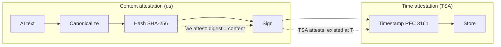

# Trust Model in Aletheia AI

**Who attests what — and how the chain fits eIDAS.**

This document describes the trust model of the Aletheia PoC: the cryptographic chain, who attests content vs. time, and how the current (non-qualified) setup maps to a future qualified (eIDAS) setup.

---

## Table of contents

- [Trust chain overview](#trust-chain-overview)
- [Who attests what](#who-attests-what)
- [Mermaid: trust chain](#mermaid-trust-chain)
- [eIDAS mapping: non-qualified → qualified](#eidas-mapping-non-qualified--qualified)
- [Conceptual summary](#conceptual-summary)
- [Related documents](#related-documents)

---

## Trust chain overview

The pipeline builds a **classic PKI trust chain**:

```
1. AI response (text)
       ↓
2. Canonicalize (deterministic bytes)
       ↓
3. Hash (SHA-256 digest)
       ↓
4. Sign (we attest: "this digest = this content")
       ↓
5. Timestamp (TSA attests: "this signature existed at this time")
       ↓
6. Store (response, hash, signature, tsa_token, metadata)
```

- **Steps 1–4** are under our control: we canonicalize, hash, and sign. We attest *what* was said.
- **Step 5** is delegated to an external TSA (RFC 3161). The TSA attests *when* the signature existed.
- **Step 6** preserves the chain for verification and audit.

A visual diagram is in [Architecture diagrams → Trust chain](../../diagrams/architecture.md#6-trust-chain).

---

## Who attests what

| Actor | Attests | Mechanism |
|-------|---------|-----------|
| **Aletheia backend** | *Content* — “this exact digest corresponds to this canonical response” | Digital signature over SHA-256 hash (RSA PKCS#1). See [Signing](SIGNING.md). |
| **TSA (Time-Stamp Authority)** | *Time* — “this signature existed at this instant” | RFC 3161 timestamp over the **signature bytes** (not the raw text). See [Timestamping](TIMESTAMPING.md). |

We do **not** timestamp the AI text directly. We timestamp the **signature**. That way:

- The signer (us) is responsible for the binding “digest ↔ content”.
- The TSA is responsible only for “signature existed at time T”.

This separation is the standard PKI pattern and keeps the chain clean for eIDAS and audit.

---

## Mermaid: trust chain

The same flow as in the [architecture diagrams](../../diagrams/architecture.md) — here focused on trust:



- **We** attest the link between digest and content (signature).
- **TSA** attests the existence of that signature at a given time.

---

## eIDAS mapping: non-qualified → qualified

The PoC uses **non-qualified** components. The architecture is designed so that the same pipeline can later use **qualified** (eIDAS) services without redesign.

| Aspect | Non-qualified (PoC) | Qualified (future / eIDAS) |
|--------|---------------------|----------------------------|
| **Signing key** | Single RSA key from file or classpath; no HSM | QES: qualified certificate, HSM or QSCD, TSP |
| **Signature** | Standard RSA PKCS#1 over hash; we attest content | Qualified electronic signature (QES); legal effect per eIDAS |
| **TSA** | Local RFC 3161 server or stub; no legal claim | Qualified TSA (qtST); legal validity of time |
| **Verification** | We verify signature (hash + sig); no token verification | Full chain: signature + timestamp verification; LTV if needed |
| **Storage** | Same: response, hash, signature, tsa_token (opaque bytes) | Same storage model; tokens from qualified TSA |
| **Claim** | “Provable in time” — no legal validity claimed | “Legally valid” where applicable (e.g. qtST, QES) |

**Summary:** Replace “our key” with a qualified signing key and “our TSA” with a qualified TSA; the pipeline (canonicalize → hash → sign → timestamp → store) stays the same. See [Signing](SIGNING.md) and [Timestamping](TIMESTAMPING.md) for current scope and future work.

---

## Conceptual summary

- **We** attest *what* was said (signature over hash of canonical text).
- **TSA** attests *when* it was said (timestamp over signature bytes).
- The **trust model** is standard PKI; the **architecture** is eIDAS-ready.
- **Non-qualified today** → **qualified tomorrow** by swapping key and TSA, not the pipeline.

---

## Related documents

- [Signing](SIGNING.md) — what we sign, key, interface, storage.
- [Timestamping](TIMESTAMPING.md) — what we timestamp, TSA, storage, scope.
- [Architecture diagrams](../../diagrams/architecture.md) — pipeline, crypto layer, **trust chain**.
- [README](../../README.md) — design overview, run instructions.
