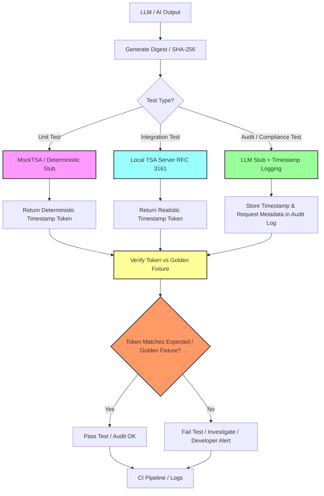

# Testimise strateegia

**Terviklik lähenemisviis Aletheia AI testimisele: unit, integration, mock-based ja end-to-end testimine krüptograafilise korrektsuse, reprodutseeritavuse ja auditeeritavuse tagamiseks.**

---

## Sisukord

- [Eesmärk](#eesmärk)
- [Testimise põhimõtted](#testimise-põhimõtted)
- [1. Ühiktestimine](#1-ühiktestimine)
- [2. Integratsioonitestimine](#2-integratsioonitestimine)
- [3. Mock'id / Deterministlikud stub'id](#3-mockid--deterministlikud-stubid)
- [4. Regressioonitestimine](#4-regressioonitestimine)
- [5. End-to-End / Smoke testimine](#5-end-to-end--smoke-testimine)
- [6. LLM / AI väljundi testimine](#6-llm--ai-väljundi-testimine)
- [7. Automatiseerimine ja CI](#7-automatiseerimine-ja-ci)
- [8. Test fixture'ite organiseerimine](#8-test-fixtureite-organiseerimine)
- [9. Märkused ja parimad praktikad](#9-märkused-ja-parimad-praktikad)
- [Seotud dokumendid](#seotud-dokumendid)

---

## Eesmärk

See dokument kirjeldab **Aletheia AI testimise strateegiat** ja seotud backend-teenuseid, keskendudes:

- **Timestamping** (RFC 3161)
- **Signing** (RSA PKCS#1 v1.5)
- **LLM-funktsioonidele** (agentide väljundid, audit trail'id)

Strateegia ühendab **unit, integration ja mock-based testimist** tagamaks:

- **Korrektsust** — krüptograafilised operatsioonid annavad valideid väljundeid
- **Reprodutseeritavust** — sama sisend annab alati sama väljundi (determinism)
- **Auditeeritavust** — kõik väljundid on kontrollitavad golden fixture'ite vastu

### Testimise workflow ülevaade



**Põhilised vood:**
- **Ühiktestid** → MockTSA (deterministlikud tokenid) → golden fixtures
- **Integratsioonitestid** → Local TSA Server (realistlikud RFC 3161 tokenid)
- **Audit/Compliance testid** → LLM Stub + Audit logging → jälgitavad tõendid

---

## Testimise põhimõtted

| Põhimõte | Kirjeldus |
|----------|-----------|
| **Determinism** | Testid on reprodutseeritavad: sama sisend → sama väljund |
| **Isoleerimine** | Ühiktestid töötavad ilma väliste sõltuvusteta (võrk, TSA, LLM) |
| **Offline-first** | Kasutatakse mock'e ja stub'e väliste teenuste jaoks |
| **Golden fixtures** | Salvestatakse etalonväljundid regressiooni testimiseks |
| **Kiire tagasiside** | Testid töötavad kiiresti CI/CD pipeline's |
| **Täielik kattuvus** | Unit → Integration → E2E |

---

## 1. Ühiktestimine

**Eesmärk:** Kontrollida väikseimaid komponente isoleeritult.

### Põhilised sihid

| Komponent | Testimise fookus |
|-----------|------------------|
| **Kanoniseerimine** | Teksti normaliseerimine (tühikud, Unicode jne) |
| **Räsimine** | SHA-256, SHA-512 väljundi korrektsus |
| **Allkirja genereerimine** | Deterministlik RSA PKCS#1 v1.5 allkirjastamine |
| **Allkirja kontrollimine** | Validi/invalidi allkirja tuvastamine |
| **Timestamp päringu vormindamine** | RFC 3161 TSQ loomine |
| **Mock TSA vastused** | TSR parseerimine ja validatsioon |

### Soovitused

- **Framework:** JUnit 5 (Java), pytest (Python), Jest (Node.js)
- **Golden fixtures:** Deterministlikud väljundid kontrollimiseks
- **Ainult offline:** Kõik testid ilma võrguta, mock'idega väliste kutsete jaoks
- **Kiiresti:** Iga test lõpeb millisekundites

### Näide (Java)

```java
@Test
void testSha256Determinism() {
    byte[] input = "hello world".getBytes(StandardCharsets.UTF_8);
    byte[] hash1 = hashService.sha256(input);
    byte[] hash2 = hashService.sha256(input);
    
    assertArrayEquals(hash1, hash2, "SHA-256 peab olema deterministlik");
    
    // Võrdlemine golden fixture'iga
    byte[] expectedHash = loadFixture("hello-world-sha256.bin");
    assertArrayEquals(expectedHash, hash1);
}
```

**Vt ka:** [HashService](../../backend/src/main/java/ai/aletheia/crypto/HashService.java), [SignatureService](../../backend/src/main/java/ai/aletheia/crypto/SignatureService.java), [SIGNING](SIGNING.md)

---

## 2. Integratsioonitestimine

**Eesmärk:** Kontrollida, et komponendid töötavad koos korrektselt.

### Põhilised sihid

| Integratsioon | Testimise fookus |
|---------------|------------------|
| **RFC 3161 flow** | TSQ loomine → TSA vastus → TSR parseerimine |
| **Signature + timestamp** | Allkirjasta sisu → timestamp allkiri → kontrolli mõlemat |
| **LLM + audit trail** | Genereeri vastus → kanoniseeri → räsi → allkirjasta → timestamp → salvesta |

### Soovitused

- **Local TSA:** Kasuta local TSA serverit või **MockTSA** reprodutseeritavuse jaoks
- **Test vectors:** Lisa [RFC 3161 testvektorid](MOCK_TSA.md#3-rfc-3161-test-vectors)
- **Edge case'd:** Vigane digest, võrgu viga, vigane vastus
- **Golden fixtures:** Baidipõhine võrdlus täielike TSR tokenite jaoks

### Näide

```java
@Test
void testTimestampSignatureFlow() throws Exception {
    String content = "AI vastus mudelist X";
    byte[] hash = hashService.sha256(content.getBytes());
    byte[] signature = signatureService.sign(hash);
    
    TimeStampRequest tsq = createTSQ(signature);
    TimeStampResponse tsr = mockTsaService.respond(tsq.getEncoded());
    
    TimeStampToken token = tsr.getTimeStampToken();
    assertNotNull(token);
    assertTrue(signatureService.verify(hash, signature));
}
```

**Vt ka:** [TimestampService](../../backend/src/main/java/ai/aletheia/crypto/TimestampService.java) (planeeritud), [TIMESTAMPING](TIMESTAMPING.md), [TRUST_MODEL](TRUST_MODEL.md)

---

## 3. Mock'id / Deterministlikud stub'id

**Eesmärk:** Offline, reprodutseeritav testimine ilma sõltuvuseta tootmis-TSA või välistest AI teenustest.

### MockTSA

**Deterministlik Time-Stamp Authority** testimiseks. Vt [MOCK_TSA](MOCK_TSA.md).

**Võimalused:**
- **Deterministlik:** Sama sisend → sama token
- **Seadistatav:** Vigade simuleerimine, vigased vastused, network timeout
- **Offline:** Ilma võrguühenduseta, in-process
- **RFC 3161 compliant:** Tagastab valideid ASN.1 struktuure

**Kasutamine:**

```java
MockTsaService mockTsa = new MockTsaService(fixedKey, fixedCert);
byte[] digest = sha256("test content");
byte[] token = mockTsa.respond(createTSQ(digest));

// Token on identne iga kord
byte[] token2 = mockTsa.respond(createTSQ(digest));
assertArrayEquals(token, token2);
```

### LLM Stub

**Deterministlik LLM stub** agentide väljundite testimiseks ilma live LLM API-deta.

**Võimalused:**
- **Fikseeritud vastused:** Teatud prompt'd → teatud väljundid
- **Seadistatav:** Vigade simuleerimine, rate limits
- **Kiire:** Ilma API kutseteta, kohesed vastused

```java
LLMStub llmStub = new LLMStub();
llmStub.addFixedResponse("Võta kokku leping X", "Leping X väidab...");
String response = llmStub.generate("Võta kokku leping X");
assertEquals("Leping X väidab...", response);
```

**Vt ka:** [MOCK_TSA](MOCK_TSA.md), [CRYPTO_ORACLE](CRYPTO_ORACLE.md), [AGENT_AUDIT_MODEL](AGENT_AUDIT_MODEL.md)

---

## 4. Regressioonitestimine

**Eesmärk:** Vältida juhuslikke muutusi krüptograafilistes väljundites.

### Golden Fixtures

**Golden fixtures** (etalonväljundite) komplekt versioonis Git'is:

| Fixture tüüp | Näide | Eesmärk |
|--------------|-------|---------|
| **Hash** | `hello-world-sha256.bin` | Kontrollida SHA-256 väljundit |
| **Signature** | `test-message-signature.sig` | Kontrollida RSA allkirjastamist |
| **Timestamp** | `hello-world.tsr` | Kontrollida RFC 3161 tokenit |
| **Test vector** | `valid-sha256-vector.json` | Täielik TSQ/TSR paar |

**Struktuur:**

```
backend/src/test/resources/fixtures/
  ├── hashes/
  ├── signatures/
  ├── timestamps/
  └── test-vectors/
```

### Regressiooni testi näide

```java
@Test
void testHashRegressionAgainstGoldenFixture() throws Exception {
    byte[] input = "hello world".getBytes(StandardCharsets.UTF_8);
    byte[] actualHash = hashService.sha256(input);
    byte[] expectedHash = loadFixture("hashes/hello-world-sha256.bin");
    
    assertArrayEquals(expectedHash, actualHash,
        "Räsi väljund erineb golden fixture'ist - võimalik regressioon");
}
```

**Iga commit'i puhul:**
1. Käivita kõik regressiooni testid golden fixture'ite vastu
2. Kui väljund erineb → uuri, kas tahtlik või viga
3. Uuenda fixture't ainult tahtliku muutuse korral

**Vt ka:** [CRYPTO_ORACLE](CRYPTO_ORACLE.md), [RFC 3161 testvektorid](TIMESTAMPING.md#testimine-rfc-3161-testvektoritega)

### Golden Fixtures Branch strateegia

**Kontseptsioon:** Hoida eraldi Git haru (`golden-fixtures` või `test-vectors`) etalonväljunditega.

**Eelised:**
- **Versioonikontroll:** Jälgi fixture'ite arengut aja jooksul
- **Reprodutseeritavus:** Iga arendaja saab fixture'd alla laadida ja teste kontrollida
- **Regressiooni ennetamine:** Fixture'ite muutused vajavad selget commit'i + ülevaatust
- **Koostöö:** Jaga fixture'sid meeskonna, projektide või keelte vahel

**Soovitatud struktuur:**

```
golden-fixtures/                 (Git haru)
  ├── README.md                  (Kuidas kasutada fixture'sid)
  ├── metadata.json              (Genereerimise info)
  ├── hashes/
  │   ├── hello-world-sha256.bin
  │   └── manifest.json
  ├── signatures/
  │   ├── test-message-rsa.sig
  │   └── manifest.json
  ├── timestamps/
  │   ├── hello-world.tsr
  │   ├── hello-world.tsq
  │   └── manifest.json
  └── test-vectors/
      ├── valid-sha256.json
      └── manifest.json
```

**Kasutamine testides:**

```java
@Test
void testAgainstGoldenFixtureBranch() throws Exception {
    byte[] expectedToken = Files.readAllBytes(
        Paths.get("golden-fixtures/timestamps/hello-world.tsr")
    );
    
    byte[] actualToken = mockTsa.respond(createTSQ(sha256("hello world")));
    
    assertArrayEquals(expectedToken, actualToken);
}
```

**CI integratsioon:**

```yaml
- name: Checkout golden fixtures
  uses: actions/checkout@v3
  with:
    repository: aletheia-ai/golden-fixtures
    path: golden-fixtures

- name: Run regression tests
  run: ./mvnw test -Dgolden.fixtures.path=golden-fixtures/
```

---

## 5. End-to-End / Smoke testimine

**Eesmärk:** Kontrollida täielikku töövoogu local dev instansis.

### Töövoog

```
1. Genereeri LLM väljund
   ↓
2. Kanoniseeri tekst
   ↓
3. Genereeri digest (SHA-256)
   ↓
4. Allkirjasta digest
   ↓
5. Palu timestamp (MockTSA)
   ↓
6. Kontrolli allkirja ja tokenit
   ↓
7. Salvesta audit kirje
   ↓
8. Kontrolli logid, audit trail
```

### Näide

```java
@Test
void testEndToEndAuditTrail() throws Exception {
    String llmOutput = llmStub.generate("Test prompt");
    String canonical = canonicalizationService.canonicalize(llmOutput);
    byte[] hash = hashService.sha256(canonical.getBytes());
    byte[] signature = signatureService.sign(hash);
    byte[] token = timestampService.timestamp(signature);
    
    assertTrue(signatureService.verify(hash, signature));
    assertNotNull(parseTimestampToken(token));
    
    AuditRecord record = new AuditRecord(llmOutput, hash, signature, token);
    auditRepository.save(record);
    assertNotNull(auditRepository.findById(record.getId()));
}
```

---

## 6. LLM / AI väljundi testimine

**Eesmärk:** Tagada AI väljundite auditeeritavus ja verifitseeritavus.

### Strateegia

| Aspekt | Testimise lähenemine |
|--------|----------------------|
| **Determinism** | Fikseeritud prompt'd või seed korduvate väljundite jaoks |
| **Räsimine** | Kontrolli canonical → hash on deterministlik |
| **Allkirjastamine** | Kontrolli allkirja kehtivust räsi peal |
| **Timestamping** | Kontrolli tokeni vastavust golden fixture'ile (MockTSA jaoks) |
| **Audit trail** | Kontrolli täielikku kirjet (prompt, response, hash, signature, timestamp) |

### Näide

```java
@Test
void testAgentOutputAudit() throws Exception {
    String prompt = "Võta kokku dokument X";
    String response = llmStub.generate(prompt);
    
    AgentAuditRecord audit = AgentAuditRecord.builder()
        .agentId("test-agent-v1")
        .prompt(prompt)
        .response(response)
        .build();
    
    byte[] canonical = canonicalizationService.canonicalize(response).getBytes();
    byte[] hash = hashService.sha256(canonical);
    byte[] signature = signatureService.sign(hash);
    byte[] token = mockTsa.respond(createTSQ(signature));
    
    audit.setHash(hash);
    audit.setSignature(signature);
    audit.setTimestampToken(token);
    
    byte[] expectedToken = loadFixture("agent-audit-golden.tsr");
    assertArrayEquals(expectedToken, token);
}
```

**Vt ka:** [AGENT_AUDIT_MODEL](AGENT_AUDIT_MODEL.md), [CRYPTO_ORACLE](CRYPTO_ORACLE.md)

---

## 7. Automatiseerimine ja CI

**Eesmärk:** Integreeri testid CI/CD pipeline'i pideva kontrollimise jaoks.

### CI Pipeline (näide)

```yaml
test:
  runs-on: ubuntu-latest
  steps:
    - name: Checkout code
      uses: actions/checkout@v3
    
    - name: Set up Java 21
      uses: actions/setup-java@v3
      with:
        java-version: '21'
    
    - name: Run unit tests
      run: ./mvnw test
    
    - name: Run integration tests (with MockTSA)
      run: ./mvnw verify -P integration-tests
    
    - name: Verify golden fixtures
      run: ./mvnw test -Dtest=GoldenFixtureRegressionTest
```

### CI nõuded

- **MockTSA** ja **LLM stub'id** töötavad igal build'il (ilma välisteta sõltuvustest)
- **Kiire tagasiside:** Kõik testid lõpevad <5 minutiga
- **Fail build kui:**
  - Token verification ebaõnnestub
  - Hash/signature mismatch
  - Ükskõik milline deterministlik golden fixture erineb oodatust

---

## 8. Test fixture'ite organiseerimine

**Struktuur:**

```
backend/src/test/resources/
  ├── fixtures/
  │   ├── canonical/
  │   ├── hashes/
  │   ├── signatures/
  │   ├── timestamps/
  │   ├── test-vectors/
  │   └── llm/
  ├── keys/
  │   ├── test-rsa-private.pem
  │   └── mock-tsa-cert.pem
  └── application-test.properties
```

**Versioneerimine:**
- Kõik fixture'd commit'itud Git'i
- Uuendamine ainult tahtliku muutuse korral
- Dokumenteeri fixture uuendused commit message'is

---

## 9. Märkused ja parimad praktikad

### Hoia mock'id eraldi

- **Tootmiskood:** Ära kunagi impordi test mock'e
- **Testikood:** Märgista mock'id selgelt (`MockTsaService`, `LLMStub`)
- **Liidesed:** Kasuta dependency injection'it real/mock implementatsioonide vahetamiseks

### Hoia README

Lisa juhised:
- MockTSA käivitamiseks lokaalselt
- Local TSA serveri seadistamiseks (OpenSSL, EJBCA)
- Konkreetsete test suite'ide käivitamiseks
- Golden fixture'ite uuendamiseks

### Golden Fixtures'ite uuendamine

**Millal uuendada:**
- RFC 3161 või allkirjastamise reeglid arenevad
- Algoritmi uuendus (nt SHA-256 → SHA-512)
- BouncyCastle versiooni muutus
- Tahtlik formaadi muutus

**Kuidas uuendada:**
1. Käivita test uue fixture'i genereerimiseks
2. Kontrolli väljundit manuaalselt
3. Commit selge selgitusega
4. Uuenda dokumentatsiooni vajadusel

### Testi nimetamise konventsioon

```java
// Unit test
void testHashService_sha256_deterministicOutput()

// Integration test
void testTimestampService_rfc3161Flow_validToken()

// Regression test
void testGoldenFixture_helloWorld_sha256Match()

// Edge case
void testSignatureService_invalidKey_throwsException()
```

---

## Seotud dokumendid

- [MOCK_TSA](MOCK_TSA.md) — Deterministlik TSA, testvektorid, golden fixtures
- [Krüptograafiline oraakel](CRYPTO_ORACLE.md) — Testimise filosoofia, oraakli muster
- [Allkirjastamine](SIGNING.md) — RSA PKCS#1 v1.5 allkirjastamise algoritm
- [Ajatemplid](TIMESTAMPING.md) — RFC 3161 protokoll, TSA endpoint
- [Usaldusmudel](TRUST_MODEL.md) — Kes mida kinnitab, usaldusahel
- [Agentide auditi mudel](AGENT_AUDIT_MODEL.md) — LLM väljundi auditeerimine, audit kirjed
- [Implementeerimise plaan](plan.md) — Task 2.4: TimestampService implementatsioon
- [Arhitektuuri diagrammid](../../diagrams/architecture.md) — Pipeline ülevaade
- [README](../../README.md) — Projekti ülevaade, käivitamise juhised

---

**Staatus:** Elav dokument. Uuendatakse testimise praktikate arenedes.

**Litsents:** MIT (Aletheia AI projekti järgi).

**Sildid:** `#testing` `#qa` `#timestamp` `#crypto` `#LLM` `#mock` `#java` `#devops` `#ci` `#golden-fixtures`
