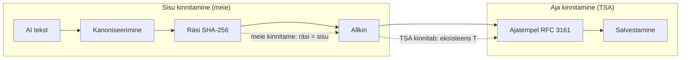

# Usaldusmudel Aletheia AI-s

**Kes mida kinnitab — ja kuidas ahel sobib eIDAS-iga.**

See dokument kirjeldab Aletheia PoC usaldusmudelit: krüptograafiline ahel, kes kinnitab sisu vs. aega, ja kuidas praegune (mittekvalifitseeritud) seadistus vastab tulevasele kvalifitseeritud (eIDAS) seadistusele.

---

## Sisukord

- [Usaldusahela ülevaade](#usaldusahela-ülevaade)
- [Kes mida kinnitab](#kes-mida-kinnitab)
- [Mermaid: usaldusahel](#mermaid-usaldusahel)
- [eIDAS vastendus: mittekvalifitseeritud → kvalifitseeritud](#eidas-vastendus-mittekvalifitseeritud--kvalifitseeritud)
- [Kontseptuaalne kokkuvõte](#kontseptuaalne-kokkuvõte)
- [Seotud dokumendid](#seotud-dokumendid)

---

## Usaldusahela ülevaade

Pipeline ehitab **klassikalise PKI usaldusahela**:

```
1. AI vastus (tekst)
       ↓
2. Kanoniseerimine (deterministlikud baitid)
       ↓
3. Räsi (SHA-256 räsi)
       ↓
4. Allkiri (meie kinnitame: "see räsi = see sisu")
       ↓
5. Ajatempel (TSA kinnitab: "see allkiri eksisteeris sel hetkel")
       ↓
6. Salvestamine (vastus, räsi, allkiri, tsa_token, metaandmed)
```

- **Sammud 1–4** on meie kontrolli all: kanoniseerime, räsime ja allkirjastame. Meie kinnitame *mida* öeldi.
- **Samm 5** on delegeeritud välistele TSA-le (RFC 3161). TSA kinnitab *millal* allkiri eksisteeris.
- **Samm 6** säilitab ahela kontrollimiseks ja auditeerimiseks.

Visuaalne diagramm on [Arhitektuuri diagrammid → Usaldusahel](../../diagrams/architecture.md#6-trust-chain).

---

## Kes mida kinnitab

| Osaleja | Kinnitab | Mehhanism |
|---------|----------|-----------|
| **Aletheia backend** | *Sisu* — "see täpne räsi vastab sellele kanoonilisele vastusele" | Digitaalne allkiri SHA-256 räsi peal (RSA PKCS#1). Vaata [Allkirjastamine](SIGNING.md). |
| **TSA (Time-Stamp Authority)** | *Aeg* — "see allkiri eksisteeris sel hetkel" | RFC 3161 ajatempel **allkirja baitide** peal (mitte toorest teksti). Vaata [Ajatemplid](TIMESTAMPING.md). |

Me **ei** märgi AI teksti otse ajatempliga. Märgime **allkirja**. Nii:

- Allkirjastaja (meie) vastutab seose "räsi ↔ sisu" eest.
- TSA vastutab ainult "allkiri eksisteeris ajal T" eest.

See eraldamine on standardne PKI muster ja hoiab ahela puhtana eIDAS ja auditi jaoks.

---

## Mermaid: usaldusahel

Sama voog nagu [arhitektuuri diagrammides](../../diagrams/architecture.md) — siin fookusega usaldusele:



- **Meie** kinnitame seose räsi ja sisu vahel (allkiri).
- **TSA** kinnitab selle allkirja olemasolu antud ajahetkel.

---

## eIDAS vastendus: mittekvalifitseeritud → kvalifitseeritud

PoC kasutab **mittekvalifitseeritud** komponente. Arhitektuur on kavandatud nii, et sama pipeline saab hiljem kasutada **kvalifitseeritud** (eIDAS) teenuseid ilma ümberkavandamiseta.

| Aspekt | Mittekvalifitseeritud (PoC) | Kvalifitseeritud (tulevik / eIDAS) |
|--------|------------------------------|------------------------------------|
| **Allkirja võti** | Üks RSA võti failist või classpathist; ilma HSM-ita | QES: kvalifitseeritud sertifikaat, HSM või QSCD, TSP |
| **Allkiri** | Standardne RSA PKCS#1 räsi peal; meie kinnitame sisu | Kvalifitseeritud elektrooniline allkiri (QES); õiguslik mõju eIDAS-i kohaselt |
| **TSA** | Lokaalne RFC 3161 server või stub; ilma õigusliku nõudmiseta | Kvalifitseeritud TSA (qtST); aja õiguslik kehtivus |
| **Kontrollimine** | Meie kontrollime allkirja (räsi + allkiri); tokeni kontrolli pole | Täielik ahel: allkirja + ajatempli kontrollimine; LTV vajadusel |
| **Salvestamine** | Sama: vastus, räsi, allkiri, tsa_token (läbipaistmatud baitid) | Sama salvestamise mudel; tokenid kvalifitseeritud TSA-st |
| **Nõue** | "Ajas tõestatav" — õiguslikku kehtivust ei väideta | "Õiguslikult kehtiv" kohaldatavalt (qtST, QES) |

**Kokkuvõte:** Asenda "meie võti" kvalifitseeritud allkirja võtmega ja "meie TSA" kvalifitseeritud TSA-ga; pipeline (kanoniseerimine → räsi → allkiri → ajatempel → salvestamine) jääb samaks. Vaata [Allkirjastamine](SIGNING.md) ja [Ajatemplid](TIMESTAMPING.md) praeguse ulatuse ja tulevase töö kohta.

---

## Kontseptuaalne kokkuvõte

- **Meie** kinnitame *mida* öeldi (allkiri kanoonilise teksti räsi peal).
- **TSA** kinnitab *millal* öeldi (ajatempel allkirja baitide peal).
- **Usaldusmudel** on standardne PKI; **arhitektuur** on eIDAS-valmis.
- **Mittekvalifitseeritud täna** → **kvalifitseeritud homme** võtme ja TSA vahetamisega, mitte pipeline'i ümberehitamisega.

---

## Seotud dokumendid

- [Allkirjastamine](SIGNING.md) — mida allkirjastame, võti, liides, salvestamine.
- [Ajatemplid](TIMESTAMPING.md) — mida ajatempliga märgime, TSA, salvestamine, ulatus.
- [Arhitektuuri diagrammid](../../diagrams/architecture.md) — pipeline, krüptokiht, **usaldusahel**.
- [README](../../README.md) — disaini ülevaade, käivitamise juhised.
