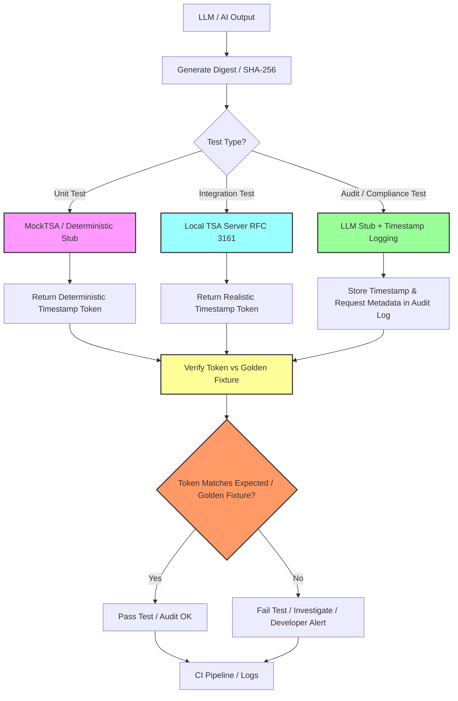

# Стратегия тестирования

**Комплексный подход к тестированию Aletheia AI: unit, integration, mock-based и end-to-end тестирование для криптографической корректности, воспроизводимости и аудируемости.**

---

## Содержание

- [Назначение](#назначение)
- [Принципы тестирования](#принципы-тестирования)
- [1. Unit-тестирование](#1-unit-тестирование)
- [2. Интеграционное тестирование](#2-интеграционное-тестирование)
- [3. Моки / Детерминированные заглушки](#3-моки--детерминированные-заглушки)
- [4. Регрессионное тестирование](#4-регрессионное-тестирование)
- [5. End-to-End / Smoke тестирование](#5-end-to-end--smoke-тестирование)
- [6. Тестирование LLM / AI выходов](#6-тестирование-llm--ai-выходов)
- [7. Автоматизация и CI](#7-автоматизация-и-ci)
- [8. Организация тестовых fixtures](#8-организация-тестовых-fixtures)
- [9. Примечания и best practices](#9-примечания-и-best-practices)
- [Связанные документы](#связанные-документы)

---

## Назначение

Этот документ описывает **стратегию тестирования для Aletheia AI** и связанных backend-сервисов, фокусируясь на:

- **Timestamping** (RFC 3161)
- **Signing** (RSA PKCS#1 v1.5)
- **LLM-функциях** (выходы агентов, audit trails)

Стратегия комбинирует **unit, integration и mock-based тестирование** для обеспечения:

- **Корректности** — криптографические операции дают валидные выходы
- **Воспроизводимости** — одинаковый вход всегда даёт одинаковый выход (детерминизм)
- **Аудируемости** — все выходы верифицируемы относительно golden fixtures

### Обзор workflow тестирования



**Ключевые потоки:**
- **Unit-тесты** → MockTSA (детерминированные токены) → golden fixtures
- **Integration-тесты** → Local TSA Server (реалистичные RFC 3161 токены)
- **Audit/Compliance-тесты** → LLM Stub + Audit logging → прослеживаемые доказательства

---

## Принципы тестирования

| Принцип | Описание |
|---------|----------|
| **Детерминизм** | Тесты воспроизводимы: одинаковый вход → одинаковый выход |
| **Изоляция** | Unit-тесты работают без внешних зависимостей (сеть, TSA, LLM) |
| **Offline-first** | Используются моки и заглушки для внешних сервисов |
| **Golden fixtures** | Сохраняются эталонные выходы для регрессионного тестирования |
| **Быстрая обратная связь** | Тесты выполняются быстро в CI/CD pipeline |
| **Полное покрытие** | Unit → Integration → E2E |

---

## 1. Unit-тестирование

**Цель:** Проверить мельчайшие компоненты изолированно.

### Основные цели

| Компонент | Фокус тестирования |
|-----------|-------------------|
| **Канонизация** | Нормализация текста (пробелы, Unicode и т.д.) |
| **Хеширование** | Корректность выхода SHA-256, SHA-512 |
| **Генерация подписи** | Детерминированное подписание RSA PKCS#1 v1.5 |
| **Верификация подписи** | Обнаружение валидной/невалидной подписи |
| **Форматирование timestamp запроса** | Создание RFC 3161 TSQ |
| **Mock TSA ответы** | Парсинг и валидация TSR |

### Рекомендации

- **Framework:** JUnit 5 (Java), pytest (Python), Jest (Node.js)
- **Golden fixtures:** Детерминированные выходы для верификации
- **Только offline:** Все тесты без сети, с моками для внешних вызовов
- **Быстро:** Каждый тест завершается за миллисекунды

### Пример (Java)

```java
@Test
void testSha256Determinism() {
    byte[] input = "hello world".getBytes(StandardCharsets.UTF_8);
    byte[] hash1 = hashService.sha256(input);
    byte[] hash2 = hashService.sha256(input);
    
    assertArrayEquals(hash1, hash2, "SHA-256 должен быть детерминированным");
    
    // Сравнение с golden fixture
    byte[] expectedHash = loadFixture("hello-world-sha256.bin");
    assertArrayEquals(expectedHash, hash1);
}
```

**См. также:** [HashService](../../backend/src/main/java/ai/aletheia/crypto/HashService.java), [SignatureService](../../backend/src/main/java/ai/aletheia/crypto/SignatureService.java), [SIGNING](SIGNING.md)

---

## 2. Интеграционное тестирование

**Цель:** Проверить, что компоненты работают вместе корректно.

### Основные цели

| Интеграция | Фокус тестирования |
|------------|-------------------|
| **RFC 3161 flow** | TSQ creation → TSA response → TSR parsing |
| **Signature + timestamp** | Sign content → timestamp signature → verify both |
| **LLM + audit trail** | Generate response → canonicalize → hash → sign → timestamp → store |

### Рекомендации

- **Local TSA:** Используйте local TSA server или **MockTSA** для воспроизводимости
- **Test vectors:** Включите [RFC 3161 test vectors](MOCK_TSA.md#3-rfc-3161-test-vectors)
- **Edge cases:** Невалидный digest, ошибка сети, некорректный ответ
- **Golden fixtures:** Побайтовое сравнение полных TSR токенов

### Пример

```java
@Test
void testTimestampSignatureFlow() throws Exception {
    String content = "AI response from model X";
    byte[] hash = hashService.sha256(content.getBytes());
    byte[] signature = signatureService.sign(hash);
    
    TimeStampRequest tsq = createTSQ(signature);
    TimeStampResponse tsr = mockTsaService.respond(tsq.getEncoded());
    
    TimeStampToken token = tsr.getTimeStampToken();
    assertNotNull(token);
    assertTrue(signatureService.verify(hash, signature));
}
```

**См. также:** [TimestampService](../../backend/src/main/java/ai/aletheia/crypto/TimestampService.java) (planned), [TIMESTAMPING](TIMESTAMPING.md), [TRUST_MODEL](TRUST_MODEL.md)

---

## 3. Моки / Детерминированные заглушки

**Цель:** Offline, воспроизводимое тестирование без зависимости от production TSA или внешних AI сервисов.

### MockTSA

**Детерминированный Time-Stamp Authority** для тестирования. См. [MOCK_TSA](MOCK_TSA.md).

**Возможности:**
- **Детерминированный:** Одинаковый вход → одинаковый токен
- **Настраиваемый:** Симуляция ошибок, невалидных ответов, network timeout
- **Offline:** Без сетевых вызовов, in-process
- **RFC 3161 compliant:** Возвращает валидные ASN.1 структуры

**Использование:**

```java
MockTsaService mockTsa = new MockTsaService(fixedKey, fixedCert);
byte[] digest = sha256("test content");
byte[] token = mockTsa.respond(createTSQ(digest));

// Токен идентичен каждый раз
byte[] token2 = mockTsa.respond(createTSQ(digest));
assertArrayEquals(token, token2);
```

### LLM Stub

**Детерминированная заглушка LLM** для тестирования выходов агентов без обращения к live LLM API.

**Возможности:**
- **Фиксированные ответы:** Известные промпты → известные выходы
- **Настраиваемый:** Симуляция ошибок, rate limits
- **Быстро:** Без API вызовов, мгновенные ответы

```java
LLMStub llmStub = new LLMStub();
llmStub.addFixedResponse("Summarize contract X", "Contract X states...");
String response = llmStub.generate("Summarize contract X");
assertEquals("Contract X states...", response);
```

**См. также:** [MOCK_TSA](MOCK_TSA.md), [CRYPTO_ORACLE](CRYPTO_ORACLE.md), [AGENT_AUDIT_MODEL](AGENT_AUDIT_MODEL.md)

---

## 4. Регрессионное тестирование

**Цель:** Предотвратить случайные изменения криптографических выходов.

### Golden Fixtures

Набор **golden fixtures** (эталонных выходов) версионируется в Git:

| Тип Fixture | Пример | Назначение |
|-------------|--------|------------|
| **Hash** | `hello-world-sha256.bin` | Верифицировать SHA-256 выход |
| **Signature** | `test-message-signature.sig` | Верифицировать RSA подписание |
| **Timestamp** | `hello-world.tsr` | Верифицировать RFC 3161 токен |
| **Test vector** | `valid-sha256-vector.json` | Полная пара TSQ/TSR |

**Структура:**

```
backend/src/test/resources/fixtures/
  ├── hashes/
  ├── signatures/
  ├── timestamps/
  └── test-vectors/
```

### Пример регрессионного теста

```java
@Test
void testHashRegressionAgainstGoldenFixture() throws Exception {
    byte[] input = "hello world".getBytes(StandardCharsets.UTF_8);
    byte[] actualHash = hashService.sha256(input);
    byte[] expectedHash = loadFixture("hashes/hello-world-sha256.bin");
    
    assertArrayEquals(expectedHash, actualHash,
        "Выход хеша отличается от golden fixture - возможна регрессия");
}
```

**При каждом коммите:**
1. Запустить все регрессионные тесты против golden fixtures
2. Если выход отличается → исследовать, намеренное ли это или баг
3. Обновить fixture только при намеренном изменении

**См. также:** [CRYPTO_ORACLE](CRYPTO_ORACLE.md), [RFC 3161 Test Vectors](TIMESTAMPING.md#тестирование-с-rfc-3161-test-vectors)

### Стратегия Golden Fixtures Branch

**Концепция:** Поддерживать отдельную Git-ветку (`golden-fixtures` или `test-vectors`) с эталонными выходами.

**Преимущества:**
- **Version control:** Отслеживать эволюцию fixtures со временем
- **Воспроизводимость:** Любой разработчик может получить fixtures и верифицировать тесты
- **Предотвращение регрессий:** Изменения fixtures требуют явного commit + review
- **Коллаборация:** Делиться fixtures между командой, проектами или языками

**Рекомендуемая структура:**

```
golden-fixtures/                 (Git branch)
  ├── README.md                  (Как использовать fixtures)
  ├── metadata.json              (Информация о генерации)
  ├── hashes/
  │   ├── hello-world-sha256.bin
  │   └── manifest.json
  ├── signatures/
  │   ├── test-message-rsa.sig
  │   └── manifest.json
  ├── timestamps/
  │   ├── hello-world.tsr
  │   ├── hello-world.tsq
  │   └── manifest.json
  └── test-vectors/
      ├── valid-sha256.json
      └── manifest.json
```

**Использование в тестах:**

```java
@Test
void testAgainstGoldenFixtureBranch() throws Exception {
    byte[] expectedToken = Files.readAllBytes(
        Paths.get("golden-fixtures/timestamps/hello-world.tsr")
    );
    
    byte[] actualToken = mockTsa.respond(createTSQ(sha256("hello world")));
    
    assertArrayEquals(expectedToken, actualToken);
}
```

**CI интеграция:**

```yaml
- name: Checkout golden fixtures
  uses: actions/checkout@v3
  with:
    repository: aletheia-ai/golden-fixtures
    path: golden-fixtures

- name: Run regression tests
  run: ./mvnw test -Dgolden.fixtures.path=golden-fixtures/
```

---

## 5. End-to-End / Smoke тестирование

**Цель:** Проверить полный workflow на local dev instance.

### Workflow

```
1. Generate LLM output
   ↓
2. Canonicalize text
   ↓
3. Generate digest (SHA-256)
   ↓
4. Sign digest
   ↓
5. Request timestamp (MockTSA)
   ↓
6. Verify signature and token
   ↓
7. Store audit record
   ↓
8. Verify logs, audit trail
```

### Пример

```java
@Test
void testEndToEndAuditTrail() throws Exception {
    String llmOutput = llmStub.generate("Test prompt");
    String canonical = canonicalizationService.canonicalize(llmOutput);
    byte[] hash = hashService.sha256(canonical.getBytes());
    byte[] signature = signatureService.sign(hash);
    byte[] token = timestampService.timestamp(signature);
    
    assertTrue(signatureService.verify(hash, signature));
    assertNotNull(parseTimestampToken(token));
    
    AuditRecord record = new AuditRecord(llmOutput, hash, signature, token);
    auditRepository.save(record);
    assertNotNull(auditRepository.findById(record.getId()));
}
```

---

## 6. Тестирование LLM / AI выходов

**Цель:** Обеспечить аудируемость и верифицируемость AI выходов.

### Стратегия

| Аспект | Подход к тестированию |
|--------|----------------------|
| **Детерминизм** | Фиксированные промпты или seed для повторяемых выходов |
| **Хеширование** | Верифицировать canonical → hash детерминирован |
| **Подписание** | Верифицировать валидность подписи над хешем |
| **Timestamping** | Верифицировать соответствие токена golden fixture (для MockTSA) |
| **Audit trail** | Верифицировать полную запись (prompt, response, hash, signature, timestamp) |

### Пример

```java
@Test
void testAgentOutputAudit() throws Exception {
    String prompt = "Summarize document X";
    String response = llmStub.generate(prompt);
    
    AgentAuditRecord audit = AgentAuditRecord.builder()
        .agentId("test-agent-v1")
        .prompt(prompt)
        .response(response)
        .build();
    
    byte[] canonical = canonicalizationService.canonicalize(response).getBytes();
    byte[] hash = hashService.sha256(canonical);
    byte[] signature = signatureService.sign(hash);
    byte[] token = mockTsa.respond(createTSQ(signature));
    
    audit.setHash(hash);
    audit.setSignature(signature);
    audit.setTimestampToken(token);
    
    byte[] expectedToken = loadFixture("agent-audit-golden.tsr");
    assertArrayEquals(expectedToken, token);
}
```

**См. также:** [AGENT_AUDIT_MODEL](AGENT_AUDIT_MODEL.md), [CRYPTO_ORACLE](CRYPTO_ORACLE.md)

---

## 7. Автоматизация и CI

**Цель:** Интегрировать тесты в CI/CD pipeline для непрерывной верификации.

### CI Pipeline (пример)

```yaml
test:
  runs-on: ubuntu-latest
  steps:
    - name: Checkout code
      uses: actions/checkout@v3
    
    - name: Set up Java 21
      uses: actions/setup-java@v3
      with:
        java-version: '21'
    
    - name: Run unit tests
      run: ./mvnw test
    
    - name: Run integration tests (with MockTSA)
      run: ./mvnw verify -P integration-tests
    
    - name: Verify golden fixtures
      run: ./mvnw test -Dtest=GoldenFixtureRegressionTest
    
    - name: Fail on regression
      if: failure()
      run: echo "Golden fixture mismatch - possible regression"
```

### CI Требования

- **MockTSA** и **LLM stubs** работают на каждом build (без внешних зависимостей)
- **Быстрая обратная связь:** Все тесты завершаются за <5 минут
- **Fail build если:**
  - Token verification падает
  - Hash/signature mismatch
  - Любой детерминированный golden fixture отличается от ожидаемого

---

## 8. Организация тестовых fixtures

**Структура:**

```
backend/src/test/resources/
  ├── fixtures/
  │   ├── canonical/
  │   ├── hashes/
  │   ├── signatures/
  │   ├── timestamps/
  │   ├── test-vectors/
  │   └── llm/
  ├── keys/
  │   ├── test-rsa-private.pem
  │   └── mock-tsa-cert.pem
  └── application-test.properties
```

**Версионирование:**
- Все fixtures закоммичены в Git
- Обновление только при намеренном изменении
- Документировать обновления fixtures в commit message

---

## 9. Примечания и best practices

### Держите моки отдельно

- **Production код:** Никогда не импортируйте test mocks
- **Test код:** Чётко маркируйте моки (`MockTsaService`, `LLMStub`)
- **Интерфейсы:** Используйте dependency injection для замены real/mock имплементаций

### Поддерживайте README

Включите инструкции для:
- Запуска MockTSA локально
- Настройки local TSA server (OpenSSL, EJBCA)
- Запуска специфических test suites
- Обновления golden fixtures

### Обновление Golden Fixtures

**Когда обновлять:**
- RFC 3161 или signing rules эволюционируют
- Обновление алгоритма (например, SHA-256 → SHA-512)
- Изменение версии BouncyCastle
- Намеренное изменение формата

**Как обновлять:**
1. Запустить тест для генерации нового fixture
2. Верифицировать выход вручную
3. Закоммитить с чётким объяснением
4. Обновить документацию при необходимости

### Конвенция именования тестов

```java
// Unit test
void testHashService_sha256_deterministicOutput()

// Integration test
void testTimestampService_rfc3161Flow_validToken()

// Regression test
void testGoldenFixture_helloWorld_sha256Match()

// Edge case
void testSignatureService_invalidKey_throwsException()
```

---

## Связанные документы

- [MOCK_TSA](MOCK_TSA.md) — Детерминированный TSA, test vectors, golden fixtures
- [Криптографический оракул](CRYPTO_ORACLE.md) — Философия тестирования, паттерн оракула
- [Подпись](SIGNING.md) — Алгоритм подписания RSA PKCS#1 v1.5
- [Временные метки](TIMESTAMPING.md) — Протокол RFC 3161, TSA endpoint
- [Модель доверия](TRUST_MODEL.md) — Кто что удостоверяет, цепочка доверия
- [Модель аудита агентов](AGENT_AUDIT_MODEL.md) — Аудит выходов LLM, audit records
- [План имплементации](plan.md) — Task 2.4: имплементация TimestampService
- [Архитектурные диаграммы](../../diagrams/architecture.md) — Обзор pipeline
- [README](../../README.md) — Обзор проекта, инструкции по запуску

---

**Статус:** Живой документ. Обновляется по мере эволюции практик тестирования.

**Лицензия:** MIT (в соответствии с проектом Aletheia AI).

**Теги:** `#testing` `#qa` `#timestamp` `#crypto` `#LLM` `#mock` `#java` `#devops` `#ci` `#golden-fixtures`
