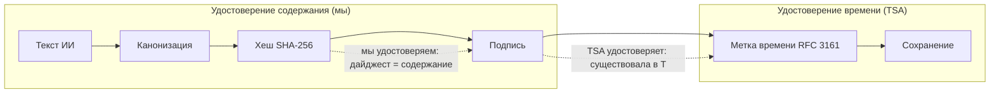

# Модель доверия в Aletheia AI

**Кто что удостоверяет — и как цепочка соотносится с eIDAS.**

В этом документе описана модель доверия PoC Aletheia: криптографическая цепочка, кто удостоверяет содержание, а кто — время, и как текущая (неквалифицированная) настройка соотносится с будущей квалифицированной (eIDAS).

---

## Содержание

- [Обзор цепочки доверия](#обзор-цепочки-доверия)
- [Кто что удостоверяет](#кто-что-удостоверяет)
- [Mermaid: цепочка доверия](#mermaid-цепочка-доверия)
- [eIDAS: неквалифицированное → квалифицированное](#eidas-соответствие-неквалифицированное--квалифицированное)
- [Концептуальное резюме](#концептуальное-резюме)
- [Связанные документы](#связанные-документы)

---

## Обзор цепочки доверия

Пайплайн строит **классическую PKI-цепочку доверия**:

```
1. Ответ ИИ (текст)
       ↓
2. Канонизация (детерминированные байты)
       ↓
3. Хеш (SHA-256 дайджест)
       ↓
4. Подпись (мы удостоверяем: «этот дайджест = это содержание»)
       ↓
5. Временная метка (TSA удостоверяет: «эта подпись существовала в этот момент»)
       ↓
6. Сохранение (ответ, хеш, подпись, tsa_token, метаданные)
```

- **Шаги 1–4** под нашим контролем: мы канонизируем, хешируем и подписываем. Мы удостоверяем *что* было сказано.
- **Шаг 5** делегирован внешней TSA (RFC 3161). TSA удостоверяет *когда* подпись существовала.
- **Шаг 6** сохраняет цепочку для проверки и аудита.

Визуальная диаграмма — в [Диаграммы архитектуры → Цепочка доверия](../../diagrams/architecture.md#6-trust-chain).

---

## Кто что удостоверяет

| Участник | Удостоверяет | Механизм |
|----------|--------------|----------|
| **Backend Aletheia** | *Содержание* — «этот дайджест соответствует этому каноническому ответу» | Цифровая подпись над хешем SHA-256 (RSA PKCS#1). См. [Подпись](SIGNING.md). |
| **TSA (Time-Stamp Authority)** | *Время* — «эта подпись существовала в этот момент» | RFC 3161 метка времени над **байтами подписи** (не над сырым текстом). См. [Временные метки](TIMESTAMPING.md). |

Мы **не** ставим метку времени на текст ИИ напрямую. Мы ставим метку на **подпись**. Так:

- Подписант (мы) отвечает за связку «дайджест ↔ содержание».
- TSA отвечает только за «подпись существовала в момент T».

Это разделение — стандартный PKI-подход и сохраняет цепочку чистой для eIDAS и аудита.

---

## Mermaid: цепочка доверия

Тот же поток, что и в [диаграммах архитектуры](../../diagrams/architecture.md) — здесь с фокусом на доверие:



- **Мы** удостоверяем связь между дайджестом и содержанием (подпись).
- **TSA** удостоверяет существование этой подписи в заданный момент времени.

---

## eIDAS: неквалифицированное → квалифицированное

PoC использует **неквалифицированные** компоненты. Архитектура сделана так, чтобы тот же пайплайн мог в будущем использовать **квалифицированные** (eIDAS) сервисы без переделки.

| Аспект | Неквалифицированное (PoC) | Квалифицированное (будущее / eIDAS) |
|--------|---------------------------|-------------------------------------|
| **Ключ подписи** | Один RSA-ключ из файла или classpath; без HSM | QES: квалифицированный сертификат, HSM или QSCD, TSP |
| **Подпись** | Стандартная RSA PKCS#1 над хешем; мы удостоверяем содержание | Квалифицированная электронная подпись (QES); юридический эффект по eIDAS |
| **TSA** | Локальный RFC 3161 сервер или заглушка; без юридических претензий | Квалифицированная TSA (qtST); юридическая сила времени |
| **Проверка** | Мы проверяем подпись (хеш + подпись); без проверки токена | Полная цепочка: проверка подписи + проверка метки времени; LTV при необходимости |
| **Хранение** | То же: ответ, хеш, подпись, tsa_token (непрозрачные байты) | Та же модель хранения; токены от квалифицированной TSA |
| **Претензия** | «Доказуемо во времени» — юридическая сила не заявляется | «Юридически действительно» там, где применимо (qtST, QES) |

**Итог:** Заменить «наш ключ» на квалифицированный ключ подписи и «нашу TSA» на квалифицированную TSA; пайплайн (канонизация → хеш → подпись → метка времени → сохранение) остаётся тем же. См. [Подпись](SIGNING.md) и [Временные метки](TIMESTAMPING.md) для текущего скоупа и будущих работ.

---

## Концептуальное резюме

- **Мы** удостоверяем *что* было сказано (подпись над хешем канонического текста).
- **TSA** удостоверяет *когда* это было сказано (метка времени над байтами подписи).
- **Модель доверия** — стандартная PKI; **архитектура** готова к eIDAS.
- **Неквалифицированно сегодня** → **квалифицированно завтра** заменой ключа и TSA, а не пайплайна.

---

## Связанные документы

- [Подпись](SIGNING.md) — что подписываем, ключ, интерфейс, хранение.
- [Временные метки](TIMESTAMPING.md) — что метим по времени, TSA, хранение, скоуп.
- [Диаграммы архитектуры](../../diagrams/architecture.md) — пайплайн, крипто-слой, **цепочка доверия**.
- [README](../../README.md) — обзор дизайна, инструкции по запуску.
