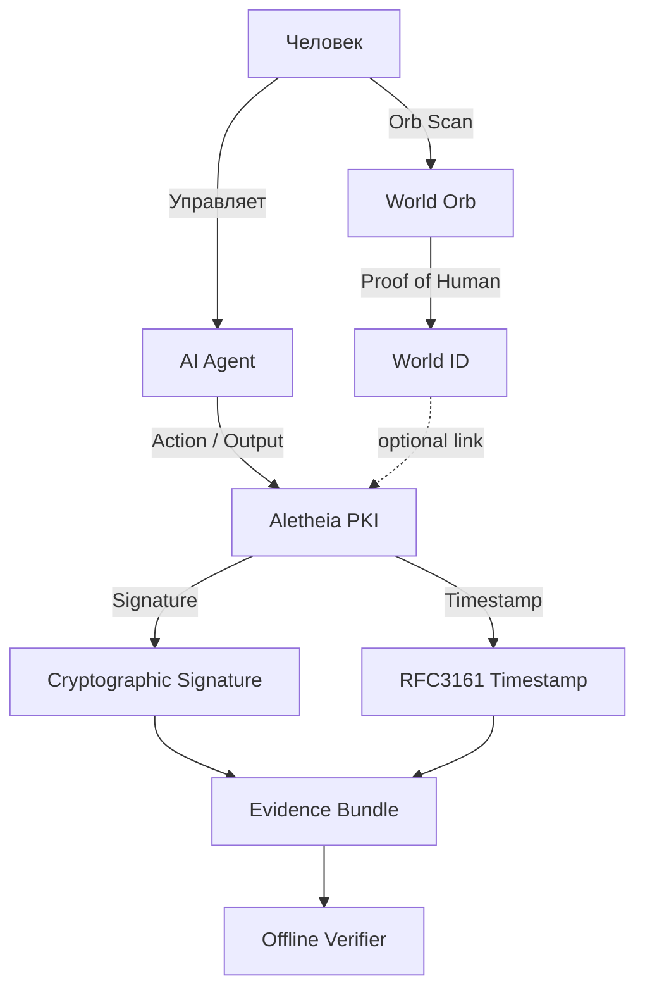

# Идея: Proof of Human (World ID / Orb) и Aletheia PKI

Кратко: слой «кто человек» и слой «кто что сделал, когда» — ортогональны. Aletheia не подменяет Proof of Human и не конкурирует с ним; они дополняют друг друга.

**Статус:** идея, не входит в текущий roadmap.  
**Связанные документы:** [Видение и дорожная карта](../VISION_AND_ROADMAP.md#смежные-слои-доверия) · [Идея: PKI для AI-агентов](PKI_FOR_AI_AGENTS.md).

---

## Зачем это нужно

AI-агенты пишут тексты, принимают решения, управляют сервисами и совершают действия с последствиями. Всё сложнее понять: где человек, где AI, кто за что отвечает. **Proof of Human** — базовый слой доверия: доказательство того, что действие инициировано реальным человеком, без раскрытия персональных данных.

**World (ранее Worldcoin)** даёт **Orb** — физическое устройство и сеть для верификации «это человек». После Orb-верификации выдаётся **World ID** — криптографически защищённый, псевдонимный идентификатор «человечности». Это один из примеров Proof-of-Human слоя; возможны и другие.

---

## Как это связано с Aletheia

Aletheia решает другую задачу:

- происхождение и подпись **результатов** AI;
- доказуемое время создания;
- офлайн-проверяемая цепочка доверия.

| Вопрос | Proof of Human (напр. World ID) | Aletheia PKI |
|--------|----------------------------------|--------------|
| Идентичность | Кто человек? | Кто подписал действие? (агент / signer) |
| Тип доказательства | Биометрия + криптография | PKI, подпись, timestamp |
| Проверка | Онлайн (как правило) | Офлайн / audit-friendly |

**Одна фраза:** Proof of Human отвечает за «кто ты (человек)», Aletheia — за «что произошло, кем и когда».

---

## Архитектура (концептуально)

Человек верифицируется через Orb и получает World ID. Тот же человек может управлять AI-агентом; агент выдаёт действия, которые Aletheia подписывает и таймстемпит. World ID может опционально связываться с Aletheia (например, как атрибут доверия при выпуске сертификата агента).

---

## Сценарии использования

### 1. Верифицированный человек → доверенный агент

1. Человек проходит Orb-верификацию и получает World ID.
2. Запускает или контролирует AI-агента.
3. Агент выполняет действие.
4. Aletheia канонизирует результат, подписывает, добавляет timestamp.

**Итог:** Доказуемо, что действие выполнено агентом, связанным с верифицированным человеком, в определённое время.

### 2. World ID как опциональный якорь для PKI

World ID может использоваться как:

- внешний атрибут доверия;
- входной сигнал для выпуска PKI-сертификата агента (например, «агент под контролем верифицированного человека»);
- proof-of-human при выдаче агентских ключей.

Это полезно для governance, доступа агентов к чувствительным операциям и юридически значимых действий.

---

## Вывод

Я не считаю World / Orb конкурентом Aletheia. Я считаю Proof of Human фундаментальным identity-слоем, который можно использовать как входной сигнал доверия и который усиливает ценность доказуемых AI-действий.

**World (Proof of Human) отвечает за «кто ты».**  
**Aletheia отвечает за «что произошло».**

Вместе они дают более полную модель доверия в мире AI-агентов. Подробнее о расширенном видении и смежных слоях: [Видение и дорожная карта](../VISION_AND_ROADMAP.md#смежные-слои-доверия).

---

*Часть раздела [Будущие идеи](README.md). Документация Aletheia AI: [индекс](../../README.md).*
